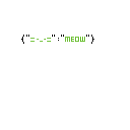
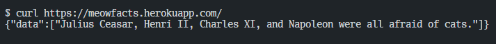
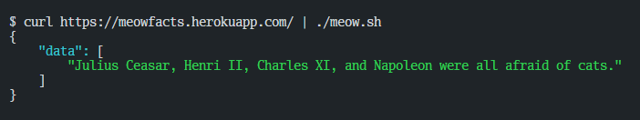

<p align="center">
  
</p>

<h1 align="center">Meow: JSON Pretty Printer</h1>

<p align="center">A simple CLI tool to pretty print your JSON.</p>

<div style="text-align: center;">
  <p style="text-align: left;"> Before: (ノಠ益ಠ)ノ彡┻━┻</p>
  
  <p style="text-align: left;"> After: 	(= ФェФ=)</p>
  
</div>

## Features

- **Pretty Printing**: Meow automatically formats JSON data with proper indentation and line breaks, ensuring that the output is clean and well-organized. This makes it easier to read and understand complex JSON structures.

- **Color-Coded Output**: To further enhance readability, Meow highlights different JSON data types with distinct colors:

  - **Strings**: <span style="color:#00FF00">Green</span>
  - **Booleans**: <span style="color:#FFFF00">Yellow</span>
  - **Numbers**: <span style="color:#FF00FF">Magenta</span>
  - **Map Keys**: <span style="color:#00FFFF">Cyan</span>

- **CLI Integration**: Meow seamlessly integrates with the command line, supporting input redirection and pipes. This allows users to easily format JSON data from files, APIs, or other command-line tools.

## Requirements

- **Java 17 or higher**

## Installation

### Using the JAR File

1. **Download the JAR file**

   Download the latest `meow.jar` from the [releases page](https://github.com/your-repo/releases).

2. **Run the tool**

   To pretty print JSON, run the following command:

   ```bash
   echo '{"=-..-=": "MEOW"}' | java -jar meow.jar
   ```

3. **Create a Script for Convenience**

   You can create a shell script to make running the tool easier. Create a `meow.sh` file with the following content:

   ```bash
   #!/bin/bash
   java -jar meow.jar "$@"
   ```

   Make the script executable:

   ```bash
   chmod +x meow.sh
   ```

   Now, you can use the script to pretty print JSON:

   ```bash
   echo '{"=-..-=": "MEOW"}' | ./meow.sh
   ```

## Usage

Meow can be used in various ways:

- **From a file**:

  ```bash
  java -jar meow.jar < file.json
  ```

- **From a URL**:

  ```bash
  curl -s https://api.example.com/data | java -jar meow.jar
  ```

## License

This project is licensed under the MIT License - see the [LICENSE](LICENSE) file for details.

## Contributing

Feel free to open issues or submit pull requests for any improvements or features you would like to see. Contributions are welcome!

<p align="center">
  
</p>
